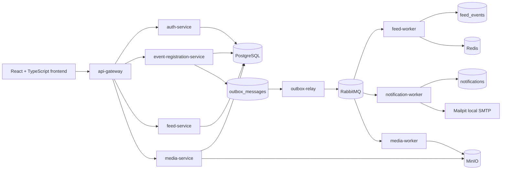

# CityEvents

CityEvents is a full-stack city event platform I built to demonstrate
microservices architecture, asynchronous messaging, transactional consistency,
secure authentication, browser E2E testing, and Kubernetes deployment
readiness.

The product goal is simple: users can discover local events, create accounts,
publish events as organizers, join events, cancel RSVPs, move through
waitlists, and let organizers or admins manage registrations. The engineering
goal is deeper: model the kind of tradeoffs a real distributed backend needs to
make around consistency, retries, idempotency, security boundaries, caching,
observability, and deployability.

## Highlights

- Go microservices with an API gateway, independent service processes, and
  separate async workers.
- PostgreSQL as the authoritative system of record for users, events,
  registrations, media metadata, outbox messages, and audit records.
- RabbitMQ asynchronous workflows using transactional outbox, publisher
  confirms, retry delays, dead-letter queues, and idempotent consumers.
- Redis used intentionally as a non-authoritative cache/rate-limit store rather
  than a source of truth.
- React + TypeScript + Vite frontend with runtime API configuration and
  Playwright browser E2E tests against the full local stack.
- JWT/RBAC security with short-lived access tokens, rotating HttpOnly refresh
  tokens, CSRF protection, backend-enforced roles, request limits, and audit
  events.
- Kubernetes manifests with replicated workloads, probes, TLS ingress,
  ConfigMap/Secret separation, PDBs, HPA intent, security contexts, topology
  spread, and NetworkPolicies.
- CI and security workflows covering Go tests, frontend tests/build, Docker
  image builds, Playwright E2E, govulncheck, npm audit, and CodeQL.

## Architecture



The public entry point is the frontend and API gateway. Internal services stay
behind the gateway and own their own business responsibilities.

## Services

| Service | Responsibility | Main paths or role |
| --- | --- | --- |
| `api-gateway` | Public routing, CORS, request middleware, protected-route checks, proxying to internal services | `/v1/auth/*`, `/v1/events*`, `/v1/feed/*`, `/v1/media/*` |
| `auth-service` | Users, password hashing, roles, JWT access tokens, rotating refresh tokens, logout revocation, auth audit events | `/v1/auth/register`, `/login`, `/refresh`, `/logout`, `/me`, `/users/{id}/role` |
| `event-registration-service` | Authoritative event state, capacity, waitlist, RSVPs, cancellation, attendee moderation, event audit events, outbox writes | `/v1/events`, `/join`, `/registrations/{userID}` |
| `feed-service` | Read-optimized event feed backed by PostgreSQL and Redis cache | `/v1/feed/events` |
| `notification-service` | Notification records and delivery state | Internal service plus worker-owned async path |
| `media-service` | Organizer/admin-authorized upload intents, presigned POST policy, object metadata, media state | `/v1/media/uploads`, `/v1/media/{id}` |
| `outbox-relay` | Polls PostgreSQL outbox rows and publishes to RabbitMQ with confirms | Worker process |
| `feed-worker` | Projects event messages into feed read models and Redis cache | RabbitMQ consumer |
| `notification-worker` | Creates notification records and local Mailpit delivery attempts | RabbitMQ consumer |
| `media-worker` | Validates uploaded objects and transitions media state | Worker process |

## Core Workflows

### Browse Events

Visitors can browse without logging in. The frontend calls the gateway, and the
gateway routes feed reads to `feed-service`.

```text
Browser -> api-gateway -> feed-service -> Redis cache -> PostgreSQL fallback
```

I treat the feed as eventually consistent. The authoritative event state lives
in `event-registration-service`; the feed is a projection optimized for fast
discovery.

### Register, Login, Refresh, Logout

```text
Browser
  -> auth-service through api-gateway
  -> PostgreSQL auth_users / refresh_tokens
  -> short-lived JWT access token returned in JSON
  -> opaque rotating refresh token stored as HttpOnly cookie
```

The frontend stores access tokens only in memory. Page reloads recover the
session by calling `/v1/auth/refresh`. Refresh and logout use double-submit
CSRF protection with a readable `cityevents_csrf` cookie and an
`X-CSRF-Token` header.

### Publish Event

Only `ORGANIZER` and `ADMIN` users can publish.

```text
POST /v1/events
  -> gateway validates the bearer token with auth-service /me
  -> event-registration-service verifies the JWT locally
  -> event-registration-service introspects auth-service for revocation/current role
  -> PostgreSQL transaction inserts:
       event row
       outbox message
       audit event
  -> outbox-relay publishes to RabbitMQ
  -> feed-worker updates the feed projection
```

The key design choice is that event state and the outbox row are written in the
same database transaction. That avoids the dual-write problem where the
database commit succeeds but a queue publish is lost.

### Join, Waitlist, Cancel

```text
POST   /v1/events/{eventID}/join
DELETE /v1/events/{eventID}/join
```

Capacity and waitlist behavior are enforced in PostgreSQL, not in the frontend
or Redis. When a confirmed attendee cancels, the service can promote the next
waitlisted user and emit an outbox message for projections/notifications.

### Organizer And Admin Management

```text
DELETE /v1/events/{eventID}/registrations/{userID}
PATCH  /v1/auth/users/{userID}/role
```

Organizers can moderate events they own. Admins can manage roles and moderate
across events. These operations write audit records so management actions are
traceable.

### Media Uploads

```text
POST /v1/media/uploads
  -> gateway validates the bearer token with auth-service /me
  -> media-service verifies the JWT locally
  -> media-service introspects auth-service for revocation/current role
  -> media-service checks event existence and organizer/admin permission
  -> media-service creates metadata and presigned POST policy
  -> browser uploads object to MinIO
  -> media-worker validates object metadata
  -> media state transitions asynchronously
```

Media is intentionally outside the event-registration transaction. That keeps
the RSVP consistency boundary small and lets slow object-storage work run
asynchronously.

## Design Choices And Tradeoffs

### Microservices Instead Of A Modular Monolith

I used microservices because the project is meant to demonstrate distributed
system boundaries: gateway routing, service-owned data, async workers,
idempotency, observability, and Kubernetes deployment shape.

The tradeoff is operational complexity. For a real early-stage product, a
modular monolith could be faster to build and easier to debug. Here,
microservices are justified because the learning goal is to show the
architecture and the tradeoffs explicitly.

### Go With Lightweight HTTP Libraries

The backend uses Go with `chi` instead of a large framework. Go keeps service
binaries small, has strong standard-library networking support, and makes
concurrency and worker processes straightforward. `chi` gives routing without
forcing a heavy application framework.

The tradeoff is that more platform behavior must be built deliberately:
configuration, middleware, error handling, JSON limits, auth helpers, metrics,
and startup wiring.

### PostgreSQL As The Source Of Truth

PostgreSQL owns the transactional state: users, events, registrations, outbox
messages, notification records, media metadata, refresh tokens, revocation
records, and audit events.

This gives strong local consistency for the most important business operations.
Redis and RabbitMQ are useful, but neither replaces the authoritative database.

### RabbitMQ And Transactional Outbox

RabbitMQ is used for asynchronous projections and side effects. The system does
not depend on a queue publish inside the same transaction as the business write.
Instead:

1. `event-registration-service` writes business state and an outbox row in one
   PostgreSQL transaction.
2. `outbox-relay` reads available outbox rows using `FOR UPDATE SKIP LOCKED`.
3. The relay publishes to RabbitMQ with publisher confirms.
4. Consumers handle duplicate deliveries with processed-message records and
   idempotent database updates.
5. Retry delay and DLQ paths stop poison messages from retrying forever.

This is an at-least-once messaging design that targets effectively-once
business effects for database-backed consumers.

Alternatives I considered:

| Alternative | Why not here |
| --- | --- |
| Direct publish after DB commit | Simpler, but can lose messages if the service crashes after commit and before publish. |
| Publish before DB commit | Can emit messages for business state that later rolls back. |
| Debezium / CDC outbox | Stronger operational pattern later, but adds Kafka/connectors and more infrastructure. |
| Event sourcing | Powerful audit/history model, but too large a redesign for this product scope. |
| Managed FIFO queue | Useful cloud option, but broker dedupe is still not the same as end-to-end exactly-once business effects. |

### Redis For Cache And Rate Limiting

Redis is used where temporary state is valuable:

- feed read caching,
- distributed HTTP rate-limit counters,
- token revocation cache acceleration.

Redis is not the source of truth. If Redis is unavailable, authoritative
business state still lives in PostgreSQL.

### React + TypeScript + Vite Frontend

The frontend uses React + TypeScript because the app has stateful workflows:
auth state, route state, event detail state, role-based UI, RSVP actions, and
runtime API configuration. TypeScript helps keep API payloads and UI state
explicit. Vite keeps the development/build loop fast.

The code is organized so `App.tsx` owns side effects and state orchestration,
while route pages, feature modules, shared components, and pure event helpers
stay separate.

### Kubernetes Manifests As Deployment Readiness

Kubernetes manifests demonstrate how the services would be deployed:
replicas, probes, ConfigMaps, Secret examples, ingress, PDBs, HPA intent,
security contexts, topology spread, and NetworkPolicies.

The tradeoff is that manifests alone are not the same as a production
operation. The next step would be running them on a real multi-node cluster
with managed backing services and recorded failure evidence.

## Security

Security features implemented in the repo:

- Short-lived JWT access tokens.
- Memory-only browser access-token storage.
- Rotating opaque refresh tokens in HttpOnly cookies.
- Refresh-token hash/family tracking in PostgreSQL.
- CSRF protection for refresh/logout cookie flows.
- Backend-enforced roles: `USER`, `ORGANIZER`, `ADMIN`.
- Gateway strips browser-supplied identity headers.
- Internal event/media services verify JWTs locally and introspect auth-service
  for revocation/current role before protected operations.
- JWT verification rejects unexpected token headers and only accepts the
  `HS256`/`JWT` shape this system issues.
- Media upload intents require the event organizer or an admin, verified against
  event-registration state.
- Explicit CORS allowlist.
- Route-specific JSON body limits and unknown-field rejection.
- HTTP read/write/idle timeouts and header limits.
- Redis-backed shared rate limiting.
- Audit tables for role and event-management actions.
- CSP/security headers and script nonces in the frontend static server.
- Public Kubernetes ingress does not expose `/metrics`; service metrics can be
  protected with `METRICS_BEARER_TOKEN`, which is required outside local/test
  environments.

## Observability And Operations

The platform includes:

- structured JSON logs,
- request IDs and correlation IDs,
- traceparent propagation,
- Prometheus-style request counters and latency histograms,
- rate-limit metrics,
- async workflow metrics for outbox/consumer/DLQ behavior,
- Prometheus alert-rule examples,
- Grafana dashboard JSON for async operations,
- OpenTelemetry collector configuration,
- read-only inspection scripts and guarded repair scripts.

For debugging, a request can be followed by `X-Correlation-ID` and
`traceparent` through the gateway, service logs, RabbitMQ messages, and worker
logs. For async workflows, the main database checkpoints are
`outbox_messages`, `feed_events`, and `notifications`, which makes it possible
to explain whether a request is waiting for relay publish, broker delivery, or
consumer processing.

## Testing And Evidence

The repo includes layered verification:

- Go unit and integration tests.
- PostgreSQL/RabbitMQ/Redis/MinIO/Mailpit integration tests.
- Frontend TypeScript checks and unit tests.
- Playwright browser E2E against the full local stack.
- Docker Compose validation.
- Docker image build matrix.
- Kubernetes static manifest checks.
- GitHub Actions CI and security workflows.
- Manual heavy-evidence workflow for Minikube smoke, load evidence, and
  dependency failure evidence.

Recent CI coverage includes:

```text
CI: Go tests, frontend verify, Docker Compose validation, phase gates,
    container image builds, Playwright E2E

Security: govulncheck, npm production dependency audit, CodeQL
```

## Run Locally

Requirements:

- Go 1.25.11, matching `go.mod`
- Docker Desktop with Docker Compose v2
- Bash such as Git Bash or WSL
- Node.js 22+ and npm for frontend commands. The Bash verification scripts can
  also use `CITYEVENTS_NODE` with existing `frontend/node_modules` when npm is
  not on PATH.

Start the full app:

```bash
./scripts/start-local.sh
```

Open:

```text
http://127.0.0.1:18088
```

Seeded local admin:

```text
email: admin@cityevents.local
password: AdminPass12345
```

Stop the app:

```bash
./scripts/stop-local.sh --with-infrastructure
```

Use another frontend port:

```bash
./scripts/start-local.sh --frontend-port 18188
```

## Local Dependency Ports

| Dependency | URL |
| --- | --- |
| Postgres | `localhost:5432` |
| RabbitMQ AMQP | `localhost:5672` |
| RabbitMQ UI | `http://localhost:15672` |
| Redis | `localhost:6379` |
| MinIO API | `http://localhost:9000` |
| MinIO Console | `http://localhost:9001` |
| Mailpit UI | `http://localhost:8025` |

## Verification Commands

Fast checks:

```bash
go test ./...
docker compose config --quiet
bash ./scripts/verify-frontend.sh
```

`cd frontend && npm run verify` is equivalent when npm is available.

Browser E2E:

```bash
cd frontend
npm run e2e
```

Phase gates:

```bash
./scripts/verify-phase-1.sh
./scripts/verify-phase-2.sh
./scripts/verify-phase-3.sh
./scripts/verify-phase-4.sh
./scripts/verify-phase-5.sh
./scripts/verify-phase-6.sh
./scripts/verify-phase-7.sh
./scripts/verify-phase-8.sh
./scripts/verify-phase-9.sh
./scripts/verify-phase-10.sh
./scripts/verify-phase-11.sh
./scripts/verify-phase-12.sh
./scripts/verify-phase-13.sh
./scripts/verify-phase-14.sh
./scripts/verify-phase-15.sh
```

## Repository Map

```text
cmd/                         service and worker entry points
internal/platform/           shared app, config, HTTP, authn, logging, messaging
internal/services/           domain service implementations
migrations/                  PostgreSQL schemas
frontend/                    React + TypeScript + Vite frontend and Playwright E2E
deploy/kubernetes/           Kubernetes base and local overlay
deploy/observability/        Prometheus, Grafana, OTel collector scaffolding
scripts/                     local startup, verification, evidence, repair tools
.github/workflows/           CI, security, heavy-evidence workflows
```

The public repository focuses on the code, runnable demo, architecture, and
verification evidence.

## Roadmap

The next engineering improvements I would make are:

1. Deploy the stack to a real Kubernetes cluster.
2. Replace local backing services with managed PostgreSQL, Redis, object
   storage, and a production RabbitMQ/queue option.
3. Connect the observability manifests to a live Prometheus/Grafana/OTel stack.
4. Add provider-backed email idempotency keys.
5. Record multi-node failure and autoscaling evidence.
6. Add deeper frontend accessibility and component tests.
